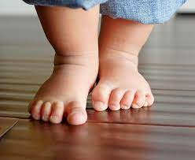

# Audio-Processing: Baby Steps

#### Introduction

* não vou ser mais um falando sobre o aparelho auditivo

  

<!--- C pg7 --->

#### Onda Sonora

É a propagação de uma "onda mecanica acustica", sé uma onda longitudinal(**1) de forma cincuncêntrica,
essa onda viaja somente por meios materiais(sólidos, liquidos ou gasosos).
[wiki Ondas_longitudinais](https://pt.wikipedia.org/wiki/Ondas_longitudinais)

Se ao ouvir um som natural podemos ter o desejo de ouvi-lo novamente a qualquer momento através de uma gravação.

Para isso precisamos capturá-lo usando um dispositivo. O equipamento utilizado para converter sinal analógico em sinal digital é chamado conversor AD.

O Conversor captura uma amostra do som a uma taxa de dezenas de milhares de vezes por segundo.
Nesse processo de conversão o audio sofre perdas, quando convertido do domínio continuo(infinito) para o discreto(finito) e dessa forma pode ser armazenado.
Esse processo de conversão atingiu um grau elevado de precisão que essa perda não é percebida.

* Audio digital, consiste na representação digital de uma onda sonora por meio de uma sequência binaria.
  * Aplicação: Armazenamento e reprodução por meio de diversas midias: cd, internet, wav, mp3.
* Com a conversão do analógico para o digital nasceu o Processamento de Sinais Digitais, DSP. Digital Signal Processing.
* O que é processamento de sinais de audio?
  * é toda alteração intencional em um sinal de audio.

Exemplos de aplicações:

* sintese sonora (Sound Syntesis)

  * É a criação artificial de um sinal de audio, você pode reproduzir um som da natureza, um instrumento musical
* Compressão de Audio

  * Algoritmos de Compressão podem reduzir  o tamanho dos arquivos sem comprometer a qualidade. mp3, aac, vorbis. ou o Flac sem perda.
* Filtros

  * Tecnica usada para modificar a frequencia de um audio.
    A equalização é um tipo básico de filtro, é possível ajustar a frequencia de vários componentes do audio, como os médios, graves e agudos.
* Efeitos de Audio
  reverb, delay, flanger, chorus.
* Processamentos de Voz

  * Afinar a voz em tempo real, clonar uma pessoa.
* As propriedades de um audio digital
* A representação digital da Onda
  1.1 Sine and Cosine
  gerando uma som

## Primeira Intuição

|                |                                       |
| ---------------- | --------------------------------------- |
| **First Step** |  |

> ### Algumas das propriedades do Audio Digital
>
> 1. Taxa de Amostragem (Sample Rate)
> 2. Volume
> 3. Tonalidade (Pitch)
> 4. Duração
> 5. Quantidade de bits (Bit Depth)
> 6. Taxa de Bits (Bit Rate)
> 7. Armazenamento x estrutura de dados
> 8. Frame x Sample x Chunk Size

#### **Taxa de amostragem** -  Sample Rate (sample frequency)

Uma amostra ou sample é o estado original analógico da onda sonora em um certo periodo do tempo

Uma série de amostras conectadas descrevem um trecho de audio

> Taxa de amostragem é o número de amostras por uma medida de tempo(normalmente em segundos), quando estamos captando um sinal continuo eanalógio para um sinal discreto e digital.

A `taxa de amostragem` é também chamada de frequencia de amostragem(samplig rate) ou taxa de recuperação(recevery rate). Normalmente medido em HZ hertz.
**41.200Hz**

exemplo de imagem de um som com sample hate alto e sample rate baixo

| Sample Rate | Mais usado em | OBS |
| ------------- | ------------- | ------------- |
| 8.000 Hz    | ligações telefonicas, walkie-talkie, e transmissões wireless |  |
| 11.025 Hz   | format PCM de menor qualidade, áudio MPEG e análise de subfaixas de subwoofer | Um quarto da taxa de amostragem de CDs de áudio |
| 16.000 Hz   | Extensão da frequência de banda larga sobre o padrão de 8.000 Hz para telefones Usado na maioria dos produtos modernos |  |
| 22.050 Hz   | usado para PCM de menor qualidade, áudio MPEG e análise em baixa frequência | Metade da taxa de amostragem de CDs de áudio |
| 32.000 Hz   | Usado em videocassetes digitais miniDV, fitas de vídeo com canais adicionais de áudio, DAT (modo LP), microfones sem fio digitais de alta qualidade |  |
| 44.056 Hz   | Usado por áudio digital sincronizado a sinais de vídeo coloridos NTSC |  |
| 44.100 Hz   | Padrão para CD de áudio, também amplamente usado com áudio MPEG-1 (VCD, SVCD, MP3) |  |
| 48.000 Hz   | Taxa padrão de amostragem de áudio usada em equipamentos de vídeo digital profissional, como gravadores de fita, servidores de vídeo e mesas de mixagem. | Frequência comum em equipamentos de áudio profissional |

[wiki Sampling](https://en.wikipedia.org/wiki/Sampling_(signal_processing)

#### **Volume**
  É a amplitude de uma onda sonora, uma amplituda alta, produz sons mais altos, enquanto baixas amplitudos sons mais baixos.

  exemplo de imagem de onda com volume auto e baixo

#### **Tonalidade** - Pitch
  É a frequencia das ondas sonoras, altas frequencias produzem valores mais altos, baixas frequências produzem valores mais baixos

  exemplo de imagem de onda com tonalidade auta e baixa

#### Bit Depth - Subchunk Size
  * indica o número de bits usado para representar cada sample
  * Maiores valores de bit depth permitem uma representação maior da amplitude do audio
  * no pão nosso de cada dia significa as tipagens: int16, int24, int32, float16, float, double

| bits | min ~ max | bits | c-type |
| -------- | -------- | -------- | -------- |
| 8 bits | 0 ~ 255 | 1 bit | char |
| 16 bits | -32768 ~ 32767 | 2 bits | signed short / float16 |

 

| BIT Depth | # of possible values (per sample) | range |
| ------ | ----------------------------------- | ------- |
| 32-bit | 4,294,967,296 | -2147483648 ~ +2147483647 |
| 16-bit | 65,536 | -32768 ~ +32767 |
| 8-bit | 256 | 0 ~ 255 |
                                      
                             
#### Bit Rate                         (44100 * 16 * channel_count)/1000
    ** É a quantidade de bits processados em uma unidade de tempo(segundos/minutos/horas)
    ** Ele é o produto da taxa de amostragem, da profundidade de bits e do número de canais
    ** normalmente representado em kbps ou Mbps

#### Duration                         (byte length / bit_rate) * 1000
    ** o tamanho total do arquivo em horas, minutos, segundos...
* Byte array for PCM data          length of pcm file or wave file minus header
    ** size of byte-array sampling rate * duration * channels * sizeof(signed short)

#### Sample

A menor porção de um audio, ele representa parte uma onda em um ponto específico do tempo.

> Frame é o conjunto de Samples por amostragem de tempo, normalemte usa valores entre 512 ou 1024 bits representa a estrutura em bytes, um chunk.
> Frame possui um sample de cada canal
    Frame Size = Sample * channels
    Frame Rate = Frames/second

  Se eu tenho 1 segundo de audio 44100hz mono, significa que eu tenho um frame 44100 samples
  Se eu tenho 1 segundo de audio 44100hz stereo, significa que eu tenho 88200 samples, mas o meu frame size ainda é 44100
  frame = 44100
  sample-rate = 88200
  https://developer.mozilla.org/en-US/docs/Web/API/Web_Audio_API/Basic_concepts_behind_Web_Audio_API

  Chunk-size - ou buffer.
  São os dados que enviamos para a placa de audio. Normalmente os valores 512 e 1024 são escolhidos.

  Um valor menor resulta em menos latência entre as operações, mas se for muito pequeno teremos problemas
  com a taxa de transferência de áudio e o tamanho do barramento do dispositivo de áudio.
  É importante definir um fps, ou quantas vezes por segundo o som será reproduzido.

  * canais
    ** como os canais são representados de forma sequencial no array

    Basicamente vamos falar sobre mono e stereo.
    O som mono tem um canal de audio, e o stereo tem dois, esquerda e direita.
    Para um som de um segundo a 44100Hz:

    * Um som mono vai ter 44100 frames( cada chunk-size de 1024 samples ) 44100/1024 = 43 fps
    * Um som stereo vai ter 44100 frames( cada chunk-size de 2048 samples ) 88200/2048 = 43 fps
  * Codec
    C__ pg9, G__ pg229
    PCM Format
    wav __C pg 77

  2) Second Step

  * openning an audio file __C pg 78, 79

  __C pg 75

  * playing audio data

    * we need to submit the audio data to sound card. We could use a OS low-level api,
      such as portaudio(here describe by os) or use a high-level lib like fmod(here list more libs)
  * seeking the content
    the property int position is important to determine where is the pointer at byte-array
  * libs for audio handling

    * fmod

  3) Standing on your own legs

  * audio channels
  * stereo
  * 5.1

  4) controll everything
     play
     pause
     speed
     volume
     pitch
     octave
     panning(channel volume)
     mix multiple sounds

  The Environment
  supported languages
  c++
  how to configure cmake
  how to compile to web-assembly

  python

  rust
  books:
  A) Game Audio Programming 2_ Principles and Practices-CRC-2019-2nd

  * basic literacy and code

  B) Game Audio Fundamentals_ An Introduction-Focal Press (2023)[fundamentals]

  * basic literacy

  C) Getting Started with C++ Audio Programming for Game Development-Packt Publishing (2013)

  * basic literacy
  * fmod code
  * low-level-code

  D) Audio Programming in C++. The Beginner Level-leanpub.com (2022)

  * basic literacy
  * low-level-code

  E) The Audio Programming Book-The MIT Press (2010)

  * basic literacy
  * low-level-code

  F) Linux Sound Programming-Apress (2017)

  * basic literacy
  * low-level-code
  * various libs

  G) Understand FFMPEG with source code

  * basic literacy
  * low-level-code
  * libav

  https://www.dalemultimedia.com/cv_root/note_aud/audio.htm

[//]: [//]:
